# DailyInsight – Smart Retail Management System

DailyInsight is a full-stack retail management system developed for small retailers and shop owners.
It enables businesses to manage inventory, record sales, monitor stock levels, and generate insightful reports through an easy-to-use dashboard.

---

## 🧩 Features

### 🔐 User Authentication
- Secure Sign Up & Login with password hashing.

### 📦 Inventory Management
- Add, update, delete, and track product inventory in real time.

### 💰 Sales Management
- Record sales with automatic stock deduction.

### 📊 Analytics Dashboard
- Monitor daily revenue, sales insights, and business performance.

### ⚠️ Low Stock Alerts
- Identify low-stock and out-of-stock products instantly.

### 📄 Reports
- Generate and download daily and monthly sales reports in PDF format.

### 💳 Payment Analytics
- Analyze sales based on Cash and UPI payment methods.

---

## 🛠️ Tech Stack

- **Frontend:** HTML, CSS, JavaScript, Jinja2
- **Backend:** Python, Flask
- **Database:** MySQL
- **Deployment:** AWS EC2, Gunicorn, Nginx, Route 53

---

## ☁️ AWS Architecture Overview

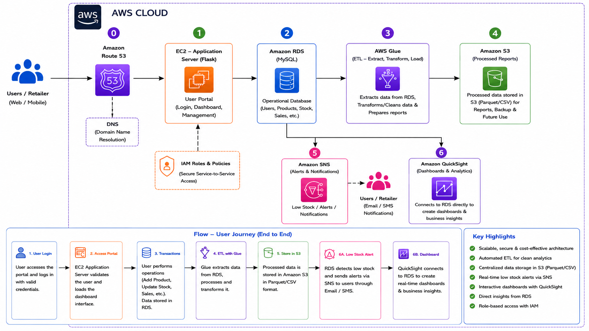

---

# 📷 Application Screenshots

| Page | Screenshot |
|------|------------|
| Register Page | 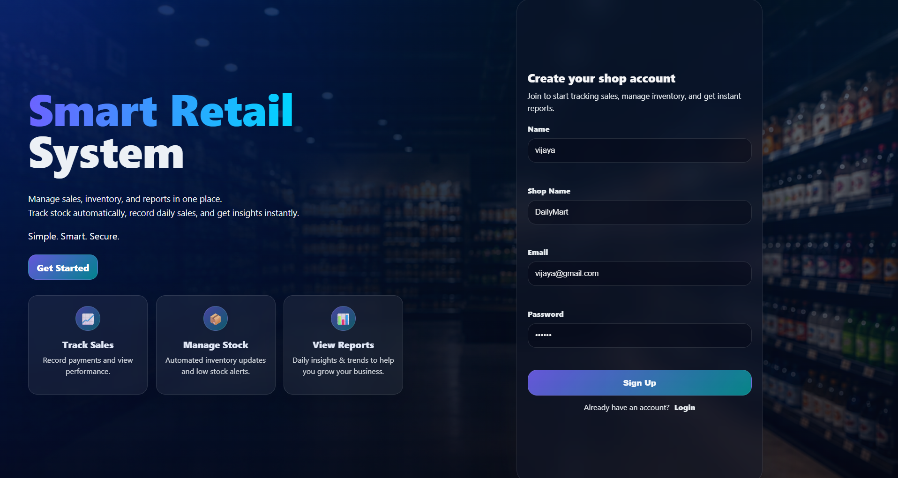 |
| Login Page | 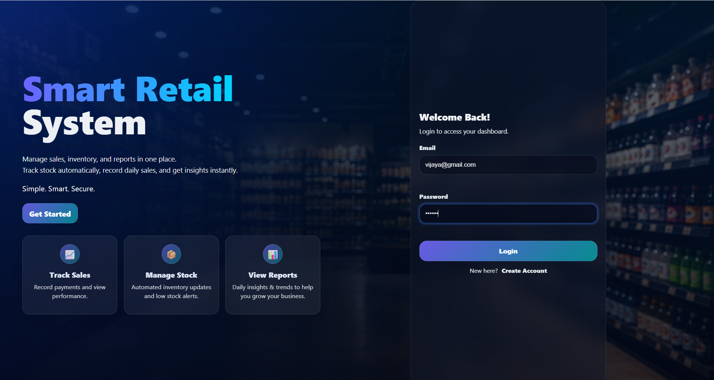 |
| Dashboard | 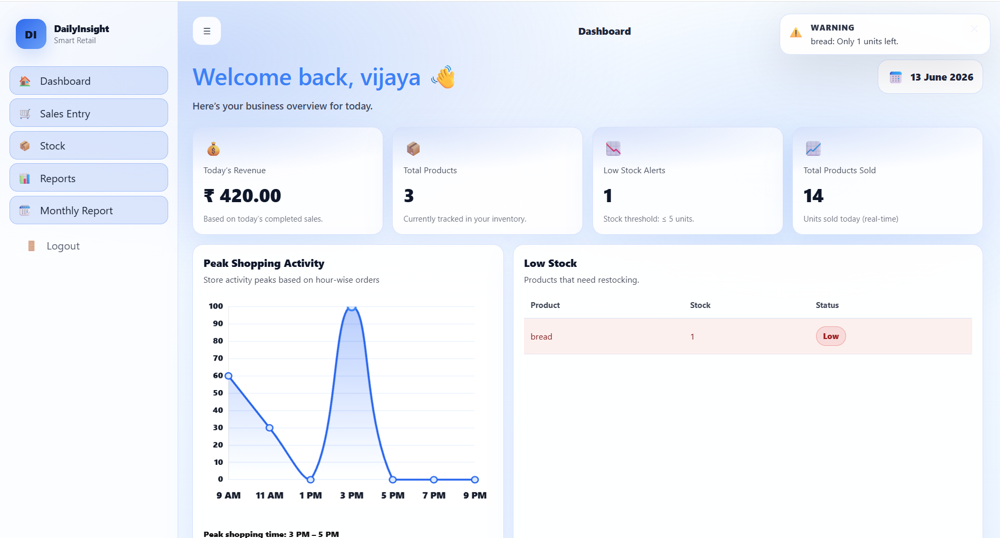 |
| Stock Management | 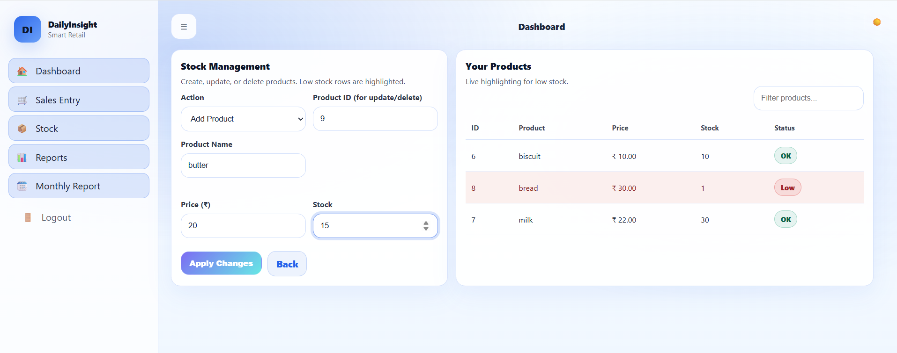 |
| Sales Entry | 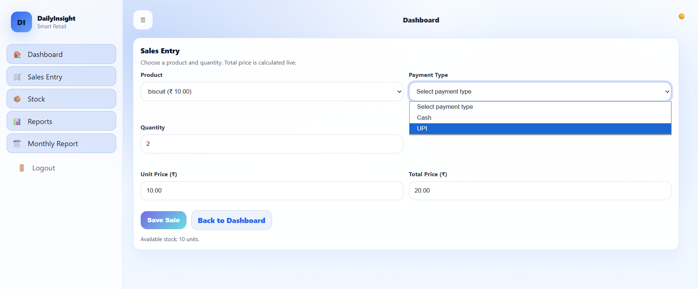 |
| Daily Reports | 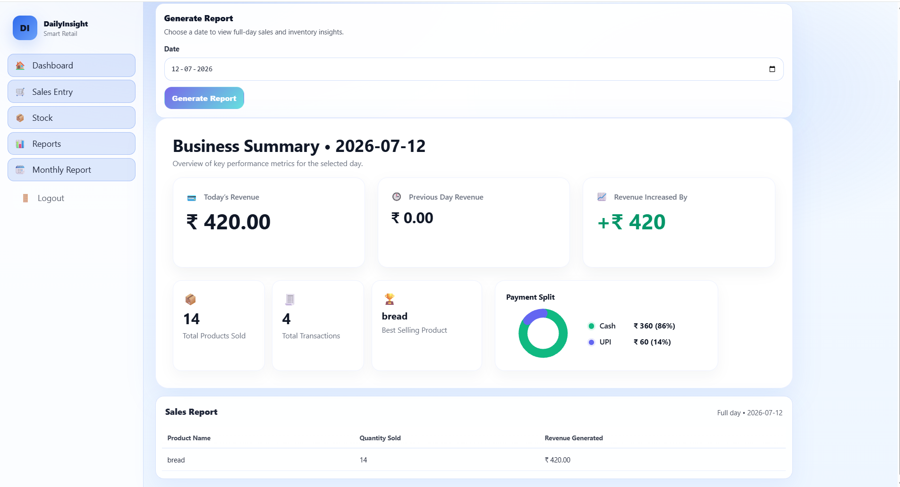 |
| Monthly Reports | 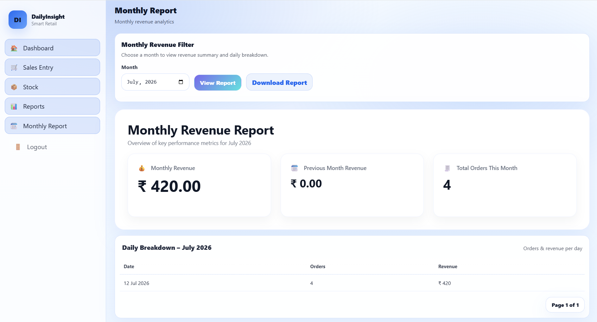 |

---

# ☁️ AWS Services Used

| AWS Service | Screenshot |
|-------------|------------|
| Route 53 | 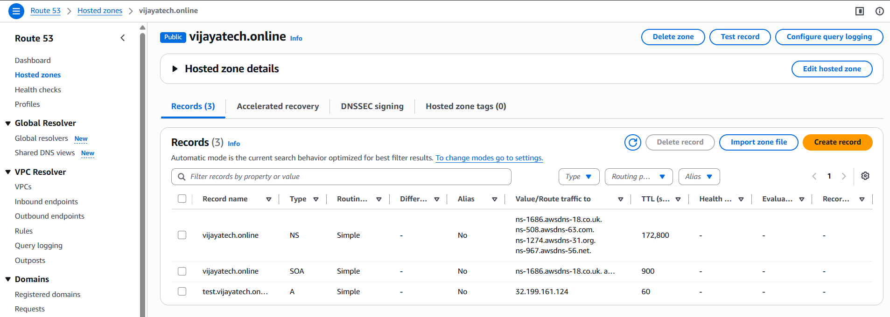 |
| Amazon EC2 | 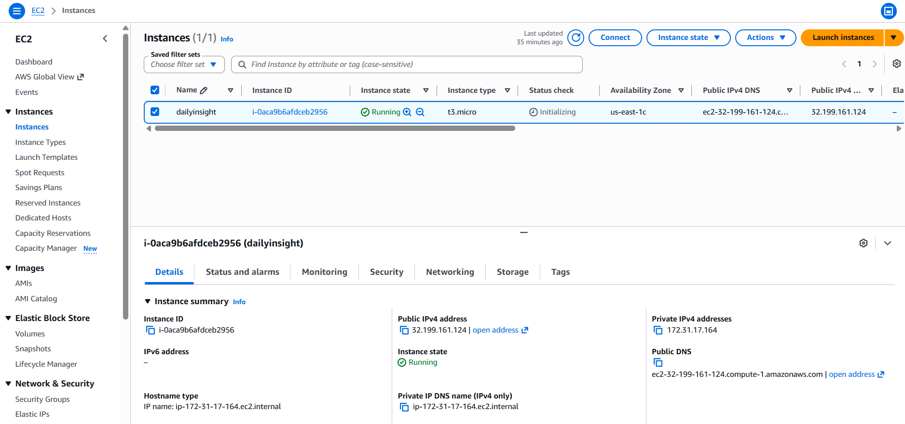 |
| Amazon RDS | 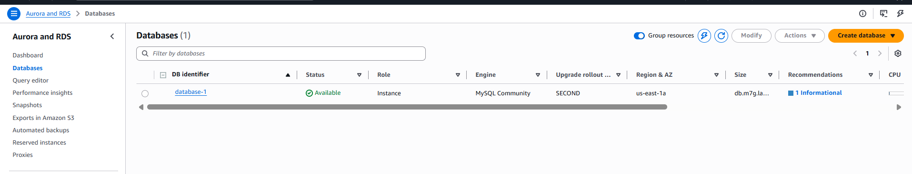 |
| AWS Glue | 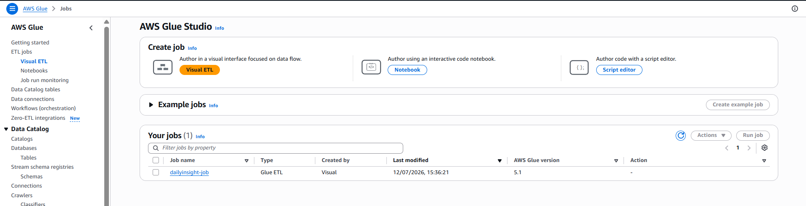 |
| Amazon S3 | 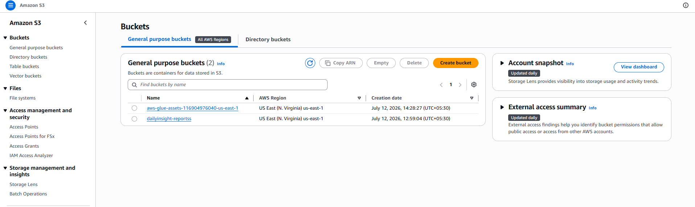 |
| Amazon SNS | 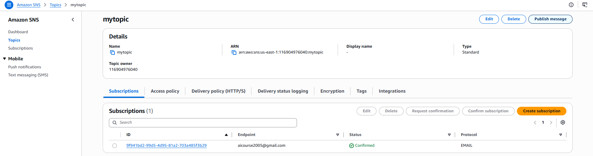 |
| Amazon QuickSight | 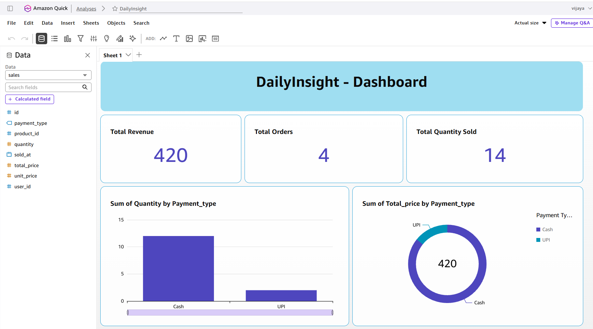 |

---

# 🚀 Deployment Steps

## 1. Launch Amazon EC2 Instance

```bash
ssh -i your-key.pem ec2-user@<EC2-Public-IP>
```

## 2. Clone Repository

```bash
git clone <repository-url>
cd Retail-System
```

## 3. Create Virtual Environment

```bash
python3 -m venv venv
source venv/bin/activate
```

## 4. Install Dependencies

```bash
pip install -r requirements.txt
```

## 5. Configure Amazon RDS

Import the database into Amazon RDS.

```bash
mysql -h <RDS-ENDPOINT> -u admin -p dailyinsight < db.sql
```

Update the RDS endpoint, username, password and database name in `app.py`.

## 6. Configure Gunicorn

```bash
sudo nano /etc/systemd/system/flaskapp.service
sudo systemctl daemon-reload
sudo systemctl enable flaskapp
sudo systemctl start flaskapp
sudo systemctl status flaskapp
```

## 7. Configure Nginx

```bash
sudo nano /etc/nginx/nginx.conf
```

Configure reverse proxy:

```nginx
location / {
    proxy_pass http://127.0.0.1:5000;
    proxy_set_header Host $host;
    proxy_set_header X-Real-IP $remote_addr;
    proxy_set_header X-Forwarded-For $proxy_add_x_forwarded_for;
    proxy_set_header X-Forwarded-Proto $scheme;
}
```

Restart Nginx:

```bash
sudo nginx -t
sudo systemctl restart nginx
sudo systemctl enable nginx
```

## 8. Access the Application

```
http://<EC2-Public-IP>
```

---

## 👨‍💻 Author

**Vijaya**
